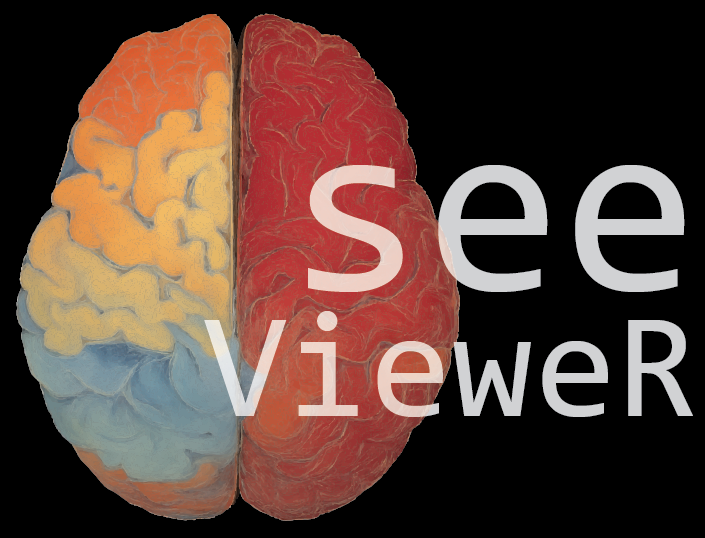
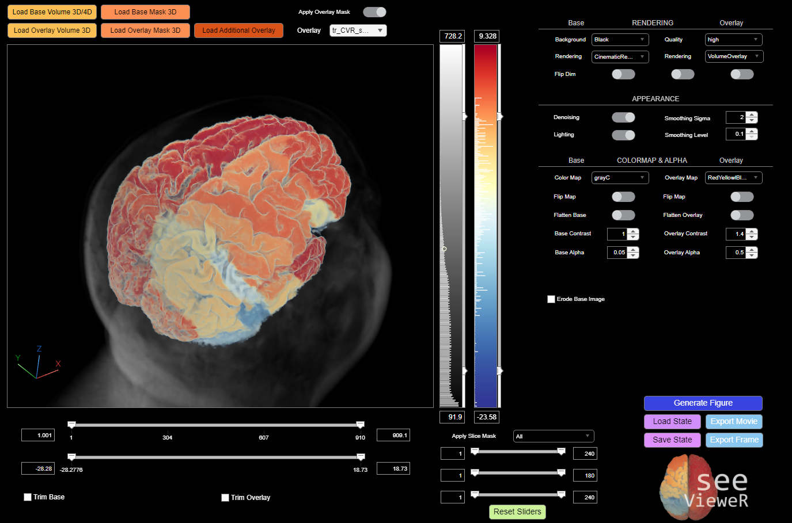
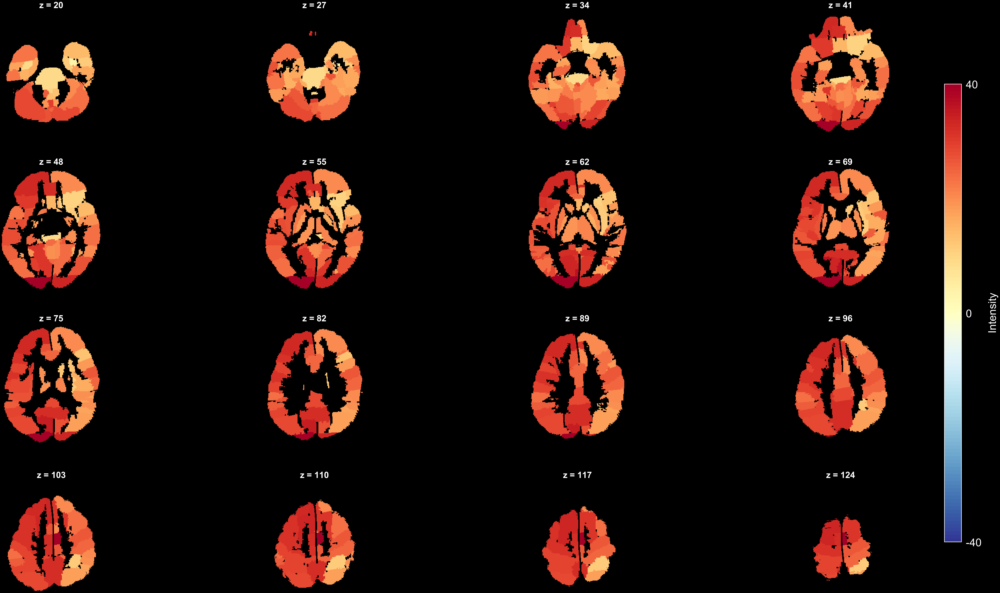
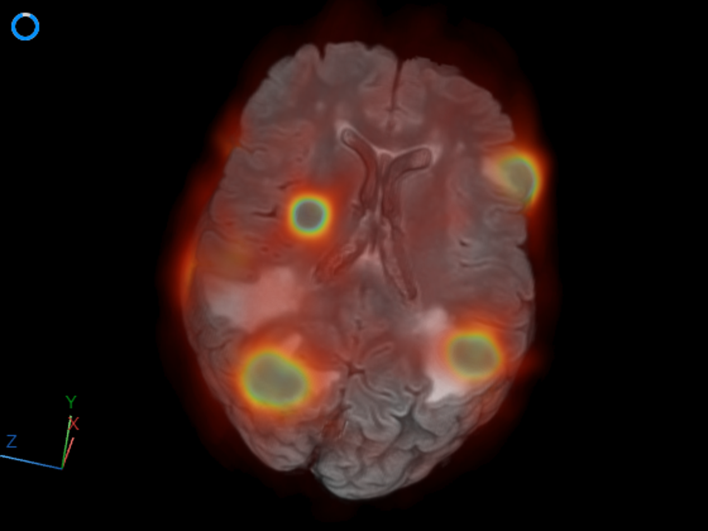

# seeVieweR 🧠🔍  
*A MATLAB App for 3D visualization of nifti data 

**seeVieweR** is a MATLAB tool for interactive exploration of 3-D and 4-D neuroimaging data.  
It supports **volume rendering, overlays, masks, erosion, slice controls, and high-quality export** — all from a clean and responsive interface.  

It is a companion to the [seeVR toolbox](https://github.com/abhogal-lab/seeVR), which is designed to process MRI vascular reactivity data

## 🎬Volumetric rendering with multiple overlays 

## ✨ Features
- **High-quality 3-D/4-D visualization**  
  

- **Overlay support**  
  Load multiple overlays with independent colormaps, thresholds, alpha transparency, and saved states.  

- **Interactive controls**  
  - Intensity and threshold sliders  
  - Slice masks (X/Y/Z)  
  - Vessel erosion with skeleton protection  
  - Adjustable opacity and contrast ramps  

- **Custom colormaps & histograms**  
  Compact colorbar panels with inline histograms (percentile-clipped & sqrt-scaled).  
  Want me to add different colormaps? .... just let me know

- **Masking**  
  - Independent masks for base and overlay image: this means you can load one
image as your base and overlay and apply different masks with unique colormaps 
too highlight regions  
  - Slice masks: apply a mask to the base image but noy overlay, or the other way
around  

- **Export & reproducibility**  
  - PNG snapshots with colorbars  
  - Quick slice mosaics in any orientation (.png or .svg)
  - Animated GIF/MP4 movie export (time series or rotating camera)  
  - Full state save/load for reproducible visualization  

## 🎬Export figures for publications 

 

## 🎬Generate 3D rendered videos

 

## 🎬One-click capture of viewer image

 

## 🚀 Installation
1. Download the latest **`seeVieweR.mlappinstall`** release from this repository.  
2. Double-click the file, or in MATLAB use:  

   matlab.apputil.install('seeVieweR.mlappinstall')
3. Once installed, seeVieweR will appear in the Apps toolbar - Launch it anytime from there — no need to add paths manually.

## 📋 Quick Reference

| Control | Function |
|---------|----------|
| **Base/Overlay Slider** | Set display intensity range. |
| **Threshold Sliders** | Hide voxels outside range (base/overlay). |
| **ORI1/ORI2/ORI3** | Slice masks in X/Y/Z. |
| **Base Alpha Spinner** | Base volume opacity. |
| **Overlay Alpha Spinner** | Overlay opacity. |
| **Contrast Spinner** | Adjust base contrast (gamma warp). |
| **Set Mask Switch** | Independently apply base/overlay masks |
| **Flip Map Switch** | Invert colormap (base/overlay). |
| **Lighting Switch** | Toggle lighting on/off. |
| **Denoising Switch** | Toggle denoising filter. |
| **Overlay Dropdown** | Switch between different overlay images. |
| **Colormap Dropdowns** | Choose base/overlay colormap. |
| **Rendering Dropdown** | Select rendering style (volume, MIP, etc.). |
| **Background Dropdown** | Set background color. |
| **Erosion Controls** | Vessel erosion with skeleton protection. |
| **Export Frame** | PNG + colorbars. |
| **Quick Plot** | Slice mosaics. |
| **Export Movie** | Animated GIF/MP4. |
| **Save/Load State** | Full restoration of viewer settings. |

## 📦 Requirements
- MATLAB R2023b or later (R2023b recommended).  
- Image Processing Toolbox.  
- Statistics & Machine Learning Toolbox (for some functions).  
- Optional: [`brewermap`](https://nl.mathworks.com/matlabcentral/fileexchange/45208-cbrew-brewer-colormaps) / [`crameri`](https://www.mathworks.com/matlabcentral/fileexchange/52398-crameri-perceptually-uniform-colormaps) colormap toolboxes.  

## 📖 License
Distributed under the GNU GPL v3 (or later). See `LICENSE` for details.  

## Dont hesitate to report bugs or make feature requests

